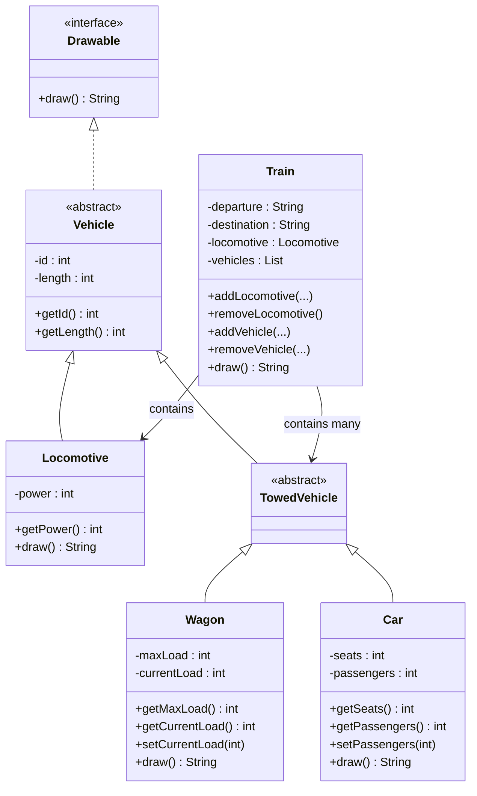

```mermaid
    classDiagram
    class Drawable {
        <<interface>>
        +draw() String
    }

    class Vehicle {
        <<abstract>>
        -id : int
        -length : int
        +getId() int
        +getLength() int
    }

    class Locomotive {
        -power : int
        +getPower() int
        +draw() String
    }

    class TowedVehicle {
        <<abstract>>
    }

    class Wagon {
        -maxLoad : int
        -currentLoad : int
        +getMaxLoad() int
        +getCurrentLoad() int
        +setCurrentLoad(int)
        +draw() String
    }

    class Car {
        -seats : int
        -passengers : int
        +getSeats() int
        +getPassengers() int
        +setPassengers(int)
        +draw() String
    }

    class Train {
        -departure : String
        -destination : String
        -locomotive : Locomotive
        -vehicles : List<TowedVehicle>
        +addLocomotive(...)
        +removeLocomotive()
        +addVehicle(...)
        +removeVehicle(...)
        +draw() String
    }

    Drawable <|.. Vehicle
    Vehicle <|-- Locomotive
    Vehicle <|-- TowedVehicle
    TowedVehicle <|-- Wagon
    TowedVehicle <|-- Car

    Train --> Locomotive : contains
    Train --> TowedVehicle : contains many
```
