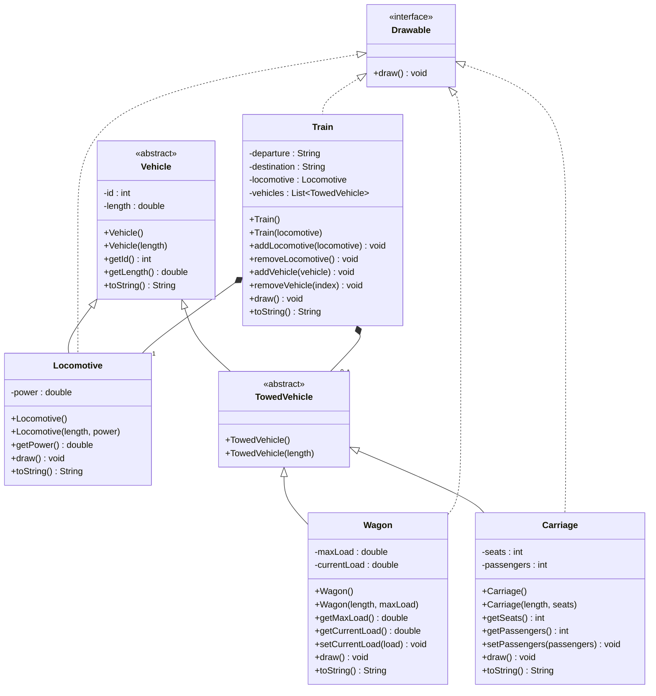

```mermaid 
classDiagram
class Drawable {
<<interface>>
+draw() void
}

    class Vehicle {
        <<abstract>>
        -id : int
        -length : double
        +Vehicle()
        +Vehicle(length)
        +getId() int
        +getLength() double
        +toString() String
    }
    
    class Locomotive {
        -power : double
        +Locomotive()
        +Locomotive(length, power)
        +getPower() double
        +draw() void
        +toString() String
    }
    
    class TowedVehicle {
        <<abstract>>
        +TowedVehicle()
        +TowedVehicle(length)
    }
    
    class Wagon {
        -maxLoad : double
        -currentLoad : double
        +Wagon()
        +Wagon(length, maxLoad)
        +getMaxLoad() double
        +getCurrentLoad() double
        +setCurrentLoad(load) void
        +draw() void
        +toString() String
    }
    
    class Carriage {
        -seats : int
        -passengers : int
        +Carriage()
        +Carriage(length, seats)
        +getSeats() int
        +getPassengers() int
        +setPassengers(passengers) void
        +draw() void
        +toString() String
    }
    
    class Train {
        -departure : String
        -destination : String
        -locomotive : Locomotive
        -vehicles : List~TowedVehicle~
        +Train()
        +Train(locomotive)
        +addLocomotive(locomotive) void
        +removeLocomotive() void
        +addVehicle(vehicle) void
        +removeVehicle(index) void
        +draw() void
        +toString() String
    }
    
    %% Héritage
    Vehicle <|-- Locomotive
    Vehicle <|-- TowedVehicle
    TowedVehicle <|-- Wagon
    TowedVehicle <|-- Carriage
    
    %% Implémentation interface
    Drawable <|.. Locomotive
    Drawable <|.. Wagon
    Drawable <|.. Carriage
    Drawable <|.. Train
    
    %% Composition avec multiplicités
    Train *-- "1" Locomotive
    Train *-- "0..*" TowedVehicle
```